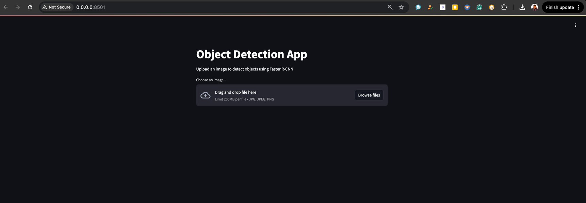

# Object Detection API with FastAPI and Docker

This project provides a FastAPI-based web service for performing real-time object detection using a pre-trained Yolo Model. The API allows users to upload an image, and it returns the detected objects in the image.

### Steps to Run the Application

1. **Clone the Repository** (if you haven't already)

    ```bash
    git clone https://github.com/your-username/object-detection-api.git
    cd object-detection-api
    ```

2. **Build and Run the Docker Container**

    First, build the Docker image:

    ```bash
    docker-compose up --build
    ```
   
    > **Note**: The first time you run the application, it will download the pre-trained model weights, which might take a few minutes. Please be patient.

3. **Access the Application**

    Once the container is running, you can access the object detection API by visiting the following URL in your browser:

    ```
    http://localhost:8501/
    ```

4. 
5. 